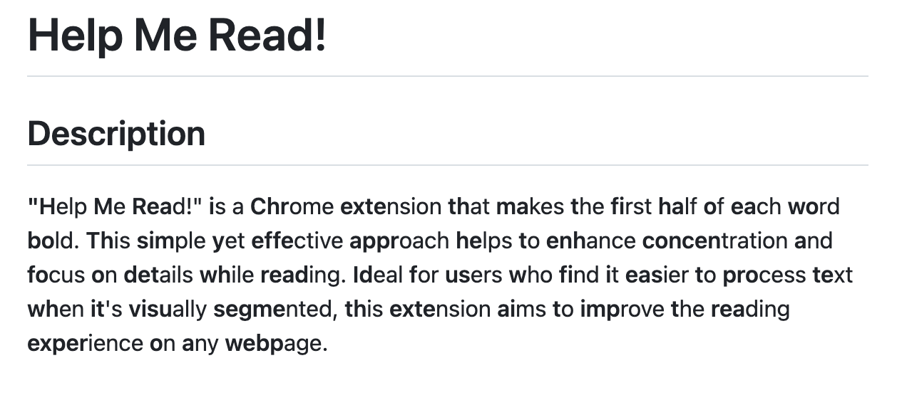

# Help Me Read!

## Description

"Help Me Read!" is a Chrome extension that makes the first half of each word bold. This simple yet effective approach helps to enhance concentration and focus on details while reading. Ideal for users who find it easier to process text when it's visually segmented, this extension aims to improve the reading experience on any webpage.

## Demo

[](https://www.youtube.com/watch?v=juDB2m_1QVY)


## Installation for Users

1. Download the extension from the Chrome Web Store.
2. Add it to your Chrome browser.
3. Click on the extension icon to activate it on any webpage.

## Installation for Developers

To set up the "Help Me Read!" extension for development:

1. Clone the Repository:

```bash
git clone https://github.com/yourusername/helpmeread.git
cd helpmeread
```

1. Open Chrome and navigate to `chrome://extensions/`.
1. Enable Developer Mode by toggling the switch in the top right corner.
1. Load the Extension:
   - Click on the 'Load unpacked' button.
   - Navigate to the directory where you cloned the repository.
   - Select the extension's folder.
1. Develop and Test:
   - Make changes to the code.
   - To test, click the 'Reload' button on the extension's card in chrome://extensions/ to apply changes.
1. Debugging:
   - Use the 'Inspect' links on the extension's card to open Developer Tools for background or popup pages.

## How to Use

After installing, simply select text on a webpage and click on the "Help Me Read!" icon in your browser's extension area.

## Contributing

Contributions to "Help Me Read!" are welcome! Whether it's reporting a bug, discussing improvements, or submitting a pull request, all contributions are appreciated.

## License

"Help Me Read!" is MIT licensed, as found in the LICENSE file.

## Acknowledgments

- Thanks to everyone who has contributed to the development and testing of this extension.
